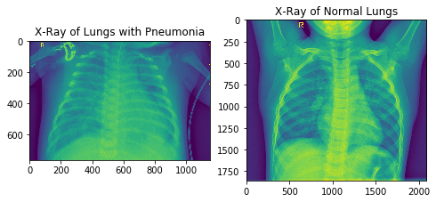

# Exploring Image Classification with Convoluted Neural Networks

## Objective

For my Module 4 project, I am working with chest x-ray images to perform a binary classification task, determining if the subject of each x-ray has pneumonia. This is a supervised learning exercise and the data was classified into test, train and validation folders by class and downloaded from Kaggle [here.](https://www.kaggle.com/paultimothymooney/chest-xray-pneumonia).

## Libraries

* For navigating directories: OS, Shutil
* For image display and plotting model performance: Matplotlib, Pillow, Scipy
* For modeling: tensorflow, keras
* For timing models: datetime
* For evaluating models: Scikit-Learn

## Dataset

This dataset consists of 5856 chest x-rays of varying image size. These images were pre-split into test/train/validation folders which I redistributed into a more balanced split of 75/15/15. To maximize the quality of the images, I kept the size of each image at 128 by 128. Additionally, I am using validation and test accuracy as the metric to evaluate the model, though as we are identifying medical conditions recall would also have been acceptable. We are dealing with slight class imbalance, but as it is in favor of our target class I conducted no resampling or downsampling in order achieve more balanced classes. I am also using data augmentation in order to improve the model, as we are only working with a training dataset of ~4000 images, with the aim of avoiding underfitting and ensuring a flexible model.

## Models

I iterated on a Convoluted Neural Network - one without and one with data augmentation, as well as a VGG19 with non-trainable CNN layers. My objective was to build a CNN with 85% accuracy on the test data. Although the model is being trained only on the train set to prevent data leakage, I set early stopping parameters and made changes to the hyperparameters based on the model's reduction of loss on the validation data, set with a patience of 20 epochs. 

Notably, as perhaps it is better to overdiagnose than it is to underdiagnose pneumonia, recall is an important score for our evaluation of the model, as this metric describes whether the model correctly classified all possible positives of a certain class.

### Evaluation

* CNN Model(**Best Recall**): As you can see above in the classification report of my baseline model, this CNN was very sensitive in classifiying a patient as having pneumonia, and only had an overall accuracy of 83%.

* CNN Model with Data Augmentation: This model performed well on our test data as well, but only achieved an accuracy of .78 on our test data, and even more heavily overclassified healthy patients with pneumonia.
* VGG19(**Best F1-Score/Accuracy**): Our VGG model achieved the highest accuracy on our test data. Similarly to our other models it is plagued by oversensitivity to our target class, but less so than our other two models.

## Conclusion
Our VGG-19 performed the best of our three highlighted models from the standpoint of not overclassifying patients with pneumonia, and our CNN from scratch achieved the highest recall, but along the way very heavily overclassified healthy patients as having pneumonia. Either seem to be a very viable model for implementing to identify x-rays, and it is worth continuing to feed new data to expand our training set, and we can continue to iterate in regards to specificity and sensitivity based on feedback from the business. 